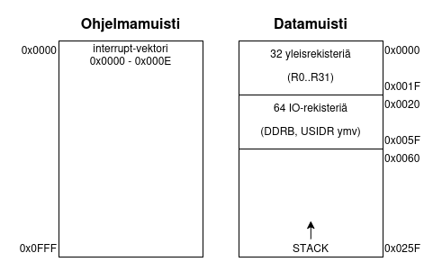
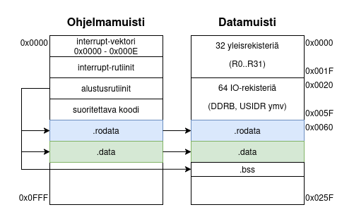

2026-02-26

# Nootteja datasegmenteistä kun yhdistelee asm ja C

Tässä viime aikoina yhdistellyt C:tä ja assemblyä AVR-kontekstissa, ja nyt törmäsin ongelmiin siinä miten passaan dataa C-puolelta assembly-puolelle.

## AVR-arkkitehtuurin muistirakenne

AVR käyttää Harvard-pohjaista suoritinarkkitehtuuria, eli suoritettava koodi ja data elää eri paikoissa. Peruskuvio on esitetty alla olevassa kuvassa.

</img>

Ohjelmamuisti (FLASH) on yksi iso (8 kt) muistijatkumo, ja datamuisti (SRAM) on pienempi (512 tavua käyttökelpoista tilaa). Virtojen mennessä päälle suoritin alkaa lukea ohjeita ohjelmamuistin alusta järjestyksessä. Ekana ohjeena on yleensä hyppy alustusrutiineihin ja muut interruptitoimenpiteet.

SRAM-puolen alussa on ALU:n käyttämät työrekisterit `R0..R31` ja niiden jälkeen muistimäpätty IO, esim. porttisuunnat määrittävä `DDRB` SRAM-osoitteessa `0x0017`, kellon arvorekisteri `TCNT0`  osoitteessa `0x0032` ja samaiseen SRAM:iin osoittava stack pointer osoitteissa `0x003E:0x003D`. Muistimäpätyn IO jälkeen alkaa vapaasti käytettävä dataosio, jota stack pointer yleensä syö sen yläpäästä. Mitään hyvin määriteltyjä heap-mekaniikkoja jotka söisi muistia alhaalta päin ei (kai) ole.

Sekä ohjelmamuistin että datamuistin osoitteet on molemmat luku- ja kirjoituskelpoisia, ja ne on eroteltu eri ohjeiden alle.

Ohjelmamuisti:
| Ohje | Nimi                 | Toiminto                                                         |
|------|----------------------|------------------------------------------------------------------|
| LPM  | Load Program Memory  | Ohjelmamuistin arvo rekisteriin, osoite Z-rekisterissä `R31:R30` |
| SPM  | Store Program Memory | Rekisterin arvo ohjelmamuistiin, osoite Z-rekisterissä           |

Datamuisti:
| Ohje | Nimi                 | Toiminto                                                         |
|------|----------------------|------------------------------------------------------------------|
| LD   | Load Indirect        | Lue datamuistin arvo rekisteriin, osoite X-/Y-/Z-rekisterissä    |
| ST   | Store Indirect       | Rekisterin arvo datamuistiin, käy X,Y tai Z pointteriksi         |
| LDS  | Load Direct          | Lue kiinteän osoitteen data rekisteriin                          |
| STS  | Store Direct         | Kirjoita kiinteän osoitteen data rekisteriin                     |
| IN   | Load IO to register  | Lue muistimäpätyn IO:n arvo rekisteriin                          |
| OUT  | Store register to IO | Kirjoita rekisterin arvo muistimäpättyyn IO                      |

SRAM:in IO-muistialueelle `0x0020..0x005F` voi siis operoida sekä ohjeilla `IN/OUT` että `LD/ST` että `LDS/STS`, mutta `IN/OUT` on kellosyklin verran nopeampia kuin vastaavat ST-ohjeet.

Huomionarvoista on että ohjelmamuistiin voi operoida vain Z-pointteria (`R31:R30`) pitkin.


## C-ohjelman muistirakenne

Näistä hommista on oikein hyvä [blogipostaus täällä](https://chessman7.substack.com/p/understanding-the-bss-segment-in).

C-ohjelmissa pyöritään käytännössä kolmessa eri tyyppisessä datassa, tilapäismuistin (STACK, rekisterit, heap) lisäksi. Löytyy yhtenäiset segmentit

- `.rodata` : fiksattu data (`ro`, read only) eli kaikki `const`-määritteiset sun muut
- `.data` : alustettujen muuttujien data, "normaali" data (`rw`)
- `.bss` : alustamattomien muuttujien data (`block starting symbol` / better save space)

Jos siis otetaan esimerkiksi kuvitteellinen datasiirtofunktiokutsu

```C
#include <stdint.h>
#include "funktio.h"

const uint8_t laiteosoite = 0xA0;
uint8_t buffer_vastaanotto[16];

void main(void)
{
    uint8_t data_laheta[] = {0xAA, 0xBB, 0xCC};
    uint8_t vastauskoodi;
    vastauskoodi = funktio_laheta_data(data_laheta, laiteosoite, buffer_vastaanotto);
}
```

niin kääntäjä asettaa muuttujien paikat muistissa
- `laiteosoite` : `.rodata` koska `const`
- `buffer_vastaanotto` : `.bss` koska alustamaton databufferi
- `data_laheta` : `.data` koska alustettu, ei-const muuttujadata
- `vastauskoodi` : `.bss` koska alustamaton muuttuja

Sain vähän semmoisen kuvan, että muistisegmenteillä ei olisi standardia järjestystä. Omassa `linker.ld` olen määrittänyt että järjestys olisi kriittisestä ei-kriittiseen, eli sen mukaan kuinka pahasti asiat menee pieleen jos STACK tulvii datan päälle: ensin `.rodata` (vakiot), sitten `.data` (alustetut muuttujat) ja lopuksi `.bss` (data joka täytetään myöhemmin).

</img>

Kun koodi käännetään, datasegmentit `.rodata` ja `.data` on binäärissä heti suorituskäskyjen jälkeen, ja ne pitää siirtää SRAM puolelle laitteen käynnistyksen yhteydessä. C:llä kirjoitettu koodi ei osaa käyttää ohjelmamuistin osotteita, vaan käyttää pelkkiä SRAM-komentoja (`LD`/`ST`). Varmaan osittain koska siinä on Tiettyjä Riskejä että kirjoittaa dataa samaan paikkaan missä ohjelmabinääri sijaitsee... Rupesin koko hommaan tarkemmin tutustumaan koska pinneistä tuli tosi eri näköistä dataa kuin mitä olin koodiin kirjoittanut, kun en ollut tätä siirtorutiinia tehnyt.

Alustusrutiinissa
1. Asetetaan stack pointer kohdilleen (yleensä datamuistin loppuun)
2. Kopioidaan ohjelmamuistin `.rodata`-alueen datat haluttuun paikkaan datamuistissa, minun toteutuksessa alkaen osoitteesta `0x0060`
3. Kopioidaan ohjelmamuistin `.data`-alueen datat haluttuun paikkaan datamuistissa, minun toteutuksessa alkaen mihin ikinä `.rodata` loppuikaan
4. Kirjoitetaan `.bss` täyteen nollaa

Neloskohta on vähän hassu ja _minun mielestä_ alustamaton data saisi olla ihan oikeasti alustamatonta, mutta C-standardi toteaa hyvin yksiselitteisesti että sen pitää olla nollalla alustettua niin mennään nyt sen mukaisesti niin ei tule yllätyksiä.

Pohjimmiltaan data-alustusrutiini on simppeli
```Assembly
; init.S

init_siirra_data:
    RJMP init_siirra_data_loop_check ; (saattaa olla että siirretään 0 tavua)
init_siirra_data_loop:
    LPM R18,Z+                       ; Lue FLASH Z:sta
    ST Y+,R18                        ; Kirjoita SRAM Y:hyn
init_siirra_data_loop_check:         ; Jatka kunnes Y==X (lopetusosoite)
    CP YL,XL
    CPC YH,XH
    BRNE init_siirra_data_loop
```
johon sitten syötetään määritellyt sijainnit X- Y- ja Z-rekistereillä, esim.
```Assembly
; init.S

init_data_sec_rodata:                 ; Kopioi .rodata
    LDI ZL,lo8(pmem_rodata_start_la)  ; Lukuosoite ohjelmamuistissa (LPM vaatii Z)
    LDI ZH,hi8(pmem_rodata_start_la)
    LDI YL,lo8(sram_rodata_start)     ; Kirjoitusosoite datamuistissa Y-rekisteriin
    LDI YH,hi8(sram_rodata_start)
    LDI XL,lo8(sram_rodata_end)       ; Kirjoituksen lopetusosoite X-rekisteriin
    LDI XH,hi8(sram_rodata_end)
    RCALL init_siirra_data
```

## Linker script

Linkkeriskriptissä täytyy tehdä vähän temppuja jotta saa linkkerille selitettyä mitkä hommat nyt sijaitsee ohjelmamuistin puolella ja mitkä _aluksi ohjelmamuistissa mutta sitten myöhemmin datamuistissa_. Ohjelmointilaitteilla voi kirjoittaa vain ohjelmamuistiin ja EEPROM:iin dataa, joten datamuistia ei saa täytettyä laitteelle kirjoitettaessa vaan se täytyy aina tehdä käynnistyksen yhteydessä.

Syntaksina on että datamuistin osoitteet on varustettu `0x00800000` kokoisella offsetillä, eli esimerkiksi tämä ATtiny-sarjan toteutus jossa dataosuus alkaa osoitteesta `0x0060` menee linkkerissä
```Linker Script
/* linker.ld */

MEMORY
{
    /* Ohjelmamuisti FLASH:issa, kirjoitettavissa ohjelmointilaitteella */
    program_memory : org = 0x0000, len = 0x0FFF
    /* Datamuisti SRAM:issa, ei voi kirjoittaa ohjelmointilaitteella ja vaatii offsetin */
    sram : org = 0x00800060, len = 512
}
```

Itse dataosuuksien määrittelyssä tarvitaan sekä datan osoite ohjelmamuistissa että kohdeosoite datamuistissa. Kiitos [jonkun kivan Stack Overflow -postaajan selvisi että se merkataan linkkeriskriptiin näin](https://stackoverflow.com/questions/68670510/avr-gnu-linker-script-how-to-get-the-load-address-of-data-section)
```Linker Script
/* linker.ld */

/* Vakiot */
.rodata : {
    pmem_rodata_start_la = LOADADDR(.rodata);
    sram_rodata_start = .;
    *.o(.rodata);
    *.o(.rodata*);
    sram_rodata_end = .;
    } >sram AT >program_memory

/* Alustetut muuttujat */
.data : {
    pmem_data_start_la = LOADADDR(.data);
    sram_data_start = .;
    *.o(.data);
    *.o(.data*);
    sram_data_end = .;
    } >sram AT >program_memory

/* Alustamattomat muuttujat, ei tarvita program_memory-osoitetta */
.bss : {
    sram_bss_start = .;
    *.o(.bss);
    *.o(.bss*);
    sram_bss_end = .;
    } >sram
```
missä `pmem`-alkuiset symbolit viittaa osoitteisiin ohjelmamuistissa ja `sram`-alkuiset osoitteisiin datamuistissa. Näihin voi sitten assembly-koodissa viitata, kuten tuossa ylempänä `init_data_sec_rodata`-komennossa tehtiin. Oleellista on kiskoa osoite binäärin puolella `LOADADDR`-komennolla ja kertoa `>sram AT >program_memory` -rimpsulla että data syö tilaa `sram`-muistialueesta mutta sijaitsee `program_memory`-muistialueessa. `.bss` koko pointti on että se ei vie binääristä tilaa joten se sijaitsee vain `sram`-alueella.
